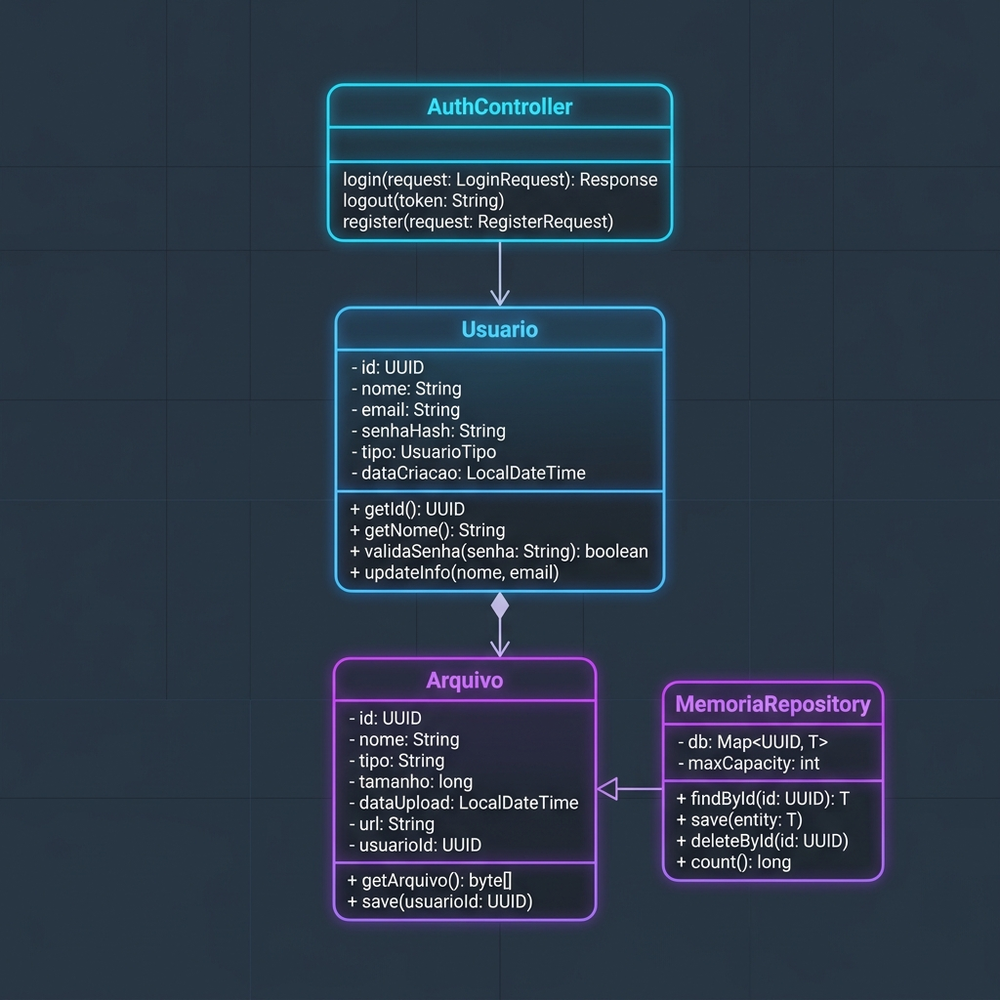
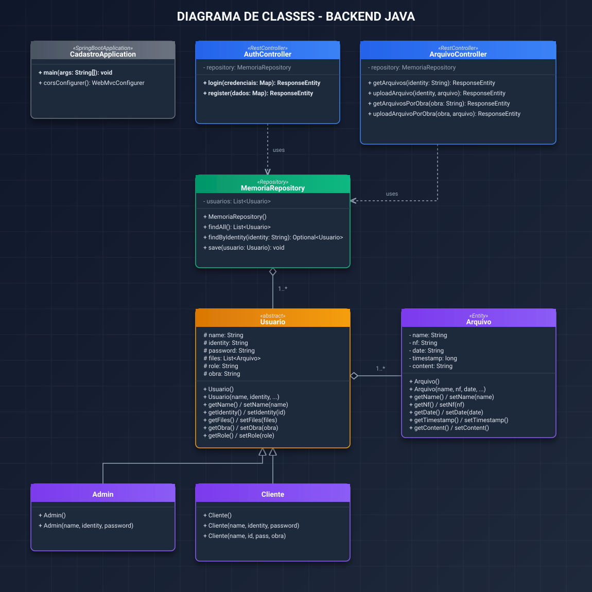
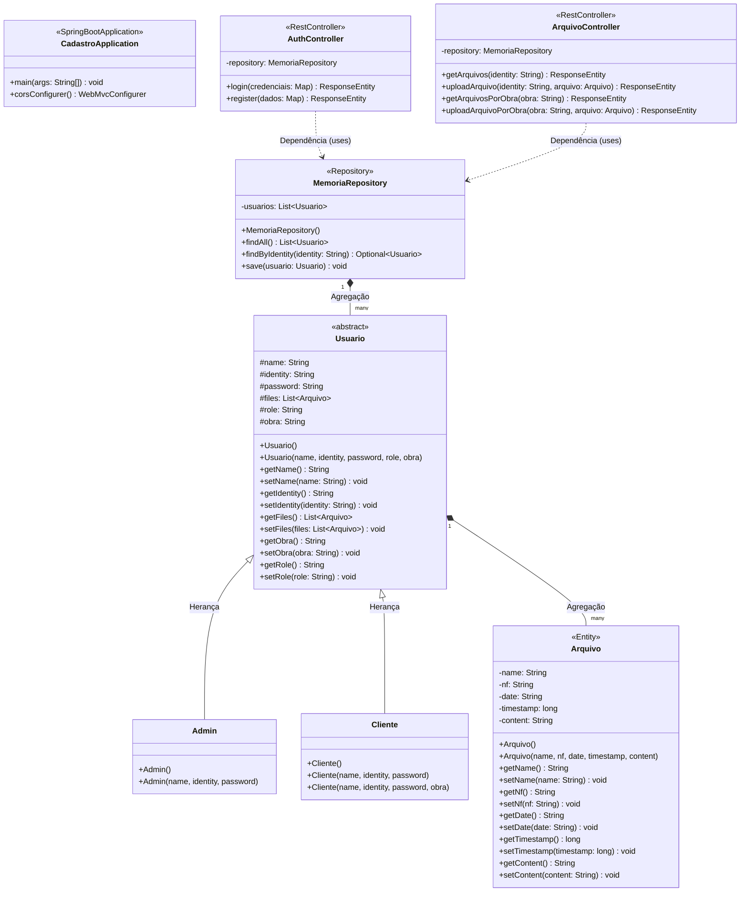

# Documentação do Diagrama de Classes - Backend Java

Este documento contém a representação visual e estrutural das classes do backend do projeto, desenvolvidas com o framework Spring Boot.

---

## 1. Diagrama Ilustrativo da Arquitetura
Esta é uma ilustração conceitual e estilizada em 3D da arquitetura de classes do sistema para uso em apresentações ou capas de documentações.

---

## 2. Diagrama de Classes Detalhado (SVG Vetorial)
Abaixo está o diagrama de classes exato gerado em formato SVG vetorial. Ele contém todos os atributos, métodos, modificadores de acesso, estereótipos do Spring Boot e relacionamentos estruturais exatos do seu código Java.

> [!TIP]
> Você pode abrir o arquivo [diagrama_classes.svg](./diagrama_classes.svg) diretamente em qualquer navegador web para visualizá-lo em tela cheia, salvá-lo como imagem ou integrá-lo a relatórios HTML.

---

## 3. Diagrama em Formato Mermaid.js
Você pode copiar o código abaixo e colar diretamente no seu arquivo `README.md` do GitHub, GitLab ou no Notion. Ele será renderizado automaticamente como um diagrama interativo.

---

## 4. Estrutura do Backend
O backend do projeto é construído em cima da arquitetura clássica MVC (Model-View-Controller) simplificada e orientada a serviços usando Spring Boot:

1. **Camada de Modelos (Domain/Model)**:
   - `Usuario`: Classe abstrata que serve de base para os tipos de usuários do sistema. Define propriedades comuns como nome, identificação, senha, papel (role), obra atribuída e a lista de arquivos.
   - `Admin` e `Cliente`: Subclasses que estendem `Usuario`, especializando o comportamento e definindo papéis padrão ("admin" e "cliente").
   - `Arquivo`: Representa os metadados e conteúdo (Base64) de um documento/nota fiscal anexado por um usuário.

2. **Camada de Acesso a Dados (Repository)**:
   - `MemoriaRepository`: Um repositório em memória anotado com `@Repository` que gerencia a persistência volátil dos usuários do sistema. Ele inicializa o usuário padrão do sistema (`admin`/`admin`).

3. **Camada de Controle (Controllers/API)**:
   - `AuthController`: Expõe os endpoints `/api/auth/login` e `/api/auth/register` para autenticação e registro de novos clientes.
   - `ArquivoController`: Expõe endpoints `/api/arquivos` para listagem e upload de arquivos por identificador de usuário ou por obra.
